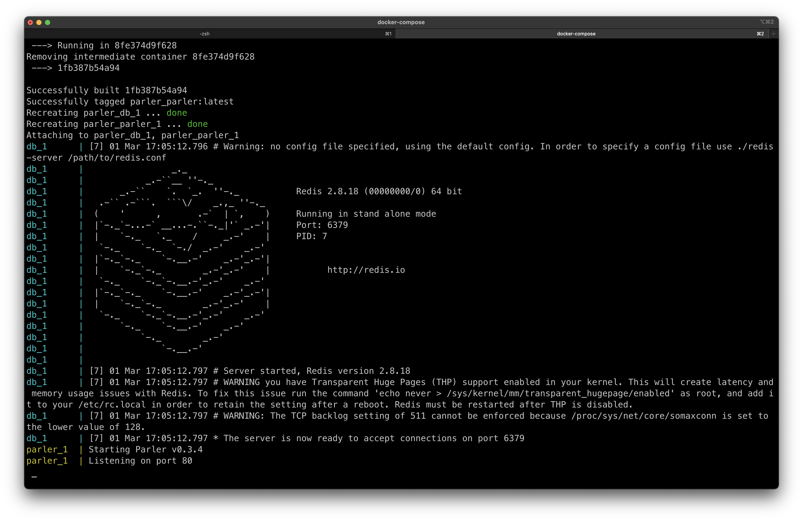
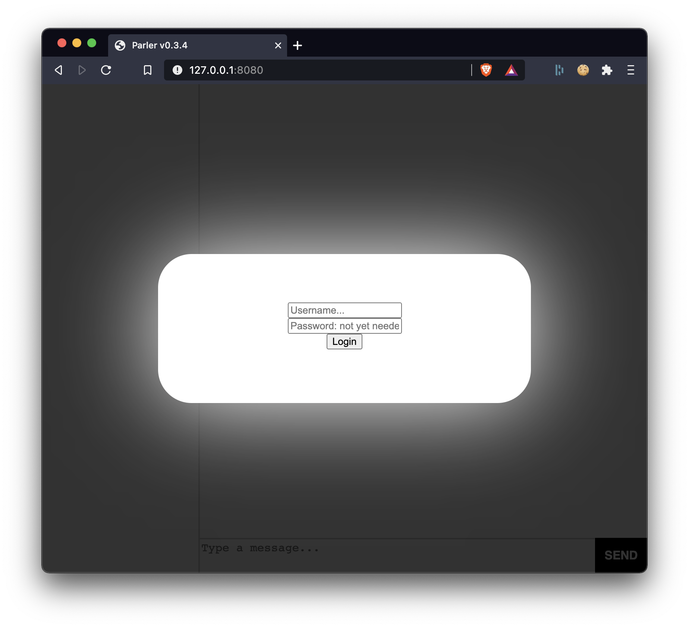
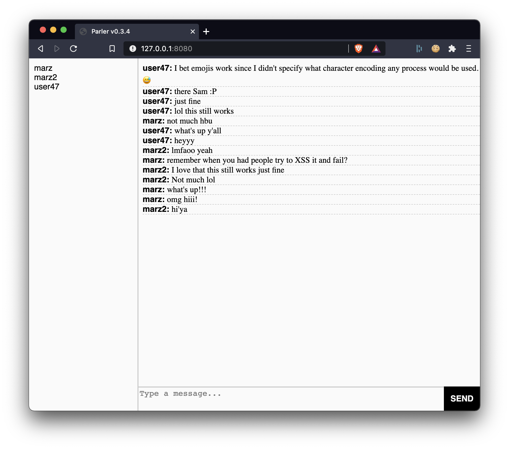

<div align="center">
    
</div>

# Parler: A simple chat application.

This is a simple chat project I created while I was a junior in highschool in 2014.

I have created a `Dockerfile` and a `docker-compose.yml` file so that you may demo this project. This necessitated the creation of [marzvrover/old-redis](https://github.com/marzvrover/old-redis): a docker container that provides [redis/redis](http://github.com/redis/redis) v2.8.18.

To run this on your computer:

```
docker-compose up
```

---
## Starting it up
<div align="center">
    
</div>

## Login
<div align="center">
    
</div>


## Messages
<div align="center">
    
</div>

